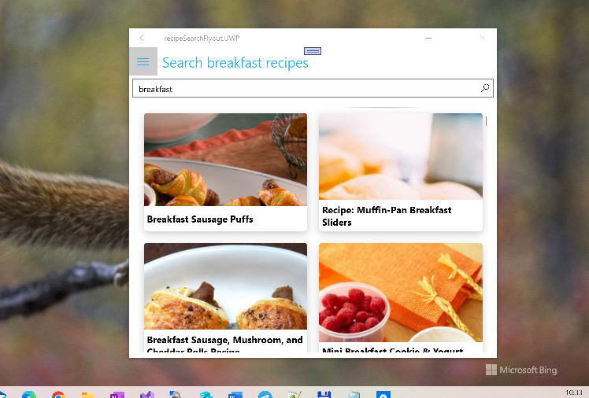
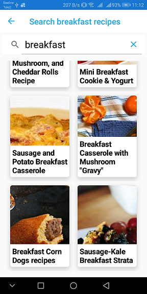

# recipeSearchFlyout

This is a fork&reimplementation of [recipeSearchFlyout app](https://github.com/rachelkang/recipeSearchFlyout/) solution adding/tuning UWP project.

## Screenshots

Recipes (Rachel's Recipes) is a cross-platform mobile application that uses Xamarin.Forms. 
It was inspired by all those who are new to cooking (dare I say, first-time chefs! :)), 
especially during these unprecedented times of quarantining, social distancing, and increased cooking. 
It is intended to provide a single place to both search for new recipes as well 
as keep track of personal ones.

_This app continues to be work-in-progress and at the moment, its primary purpose is for my personal exploration of Xamarin.Forms, to learn more about the framework as a first-time user and contributer._

## App features

1. **Recipe Search** - Users can search for recipes, by specific categories if they so choose, and add copies to their personal collection.
2. **My Recipes** - Users can create and save their own recipes using the app! Recipes can also be updated and deleted from their collection.

## NuGet packages

|Package name|
|--------------------------------------------------------|
|`NETStandard.Library`|
|`Newtonsoft.Json` |
|`Xamarin.Forms`|
|`Xamarin.Forms.Visual.Material`|
|`Xamarin.Essentials`|
|`Xamarin.CommunityToolkit`|
|`Xamarin.Plugin.SharedTransitions`|
|`Xamanimation`|
|`Resizetizer.NT`|
|`Sharpnado.Shadows`|

## Credits
_Disclaimer: Although the app is called "Rachel's Recipes", none of the recipes are her own._
* Original [recipeSearchFlyout app](https://github.com/rachelkang/recipeSearchFlyout/)
* Shell-based [recipeSearch app](https://github.com/rachelkang/recipeSearch/)
* Recipes from [Edamam](https://developer.edamam.com/) 
* Icons from [Flaticon](https://www.flaticon.com/)
* Engineering tips and morale from the [Xamarin.Forms](https://github.com/xamarin/Xamarin.Forms) team :)

## .

AS IS. No support. RnD only. 
 
## ..

[m][e] 2022
